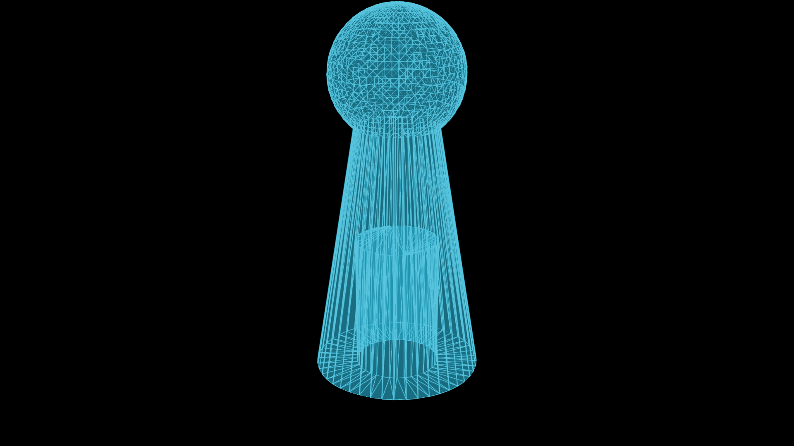

[](https://github.com/bmmtstb/manim-meshes/actions/workflows/python_ci_test.yaml) [](https://github.com/bmmtstb/manim-meshes/actions/workflows/codeql-analysis.yml)
# Manim for Meshes

> ⚠️ not fully optimal - but fine for smaller meshes
> 
> Manim and the OpenGL renderer are not really friends right now, therefore most of the code runs terribly slow for larger meshes. In Addition to the small educational meshes we present a faster mesh that uses a custom shader but this requires manipulating the manim library.
>
> Stay tuned or feel free to assist. Either here or directly in the manim OpenGL part. Not necessarily everything is a Bézier curve... 

Manim-Trimeshes implements manim functionalities for different types of meshes using either basic node-face data structures or by importing meshes from the python [trimesh](https://pypi.org/project/trimesh/ "trimesh on pypi") library.

It is mainly developed as a Project for Interactive Graphics Systems Group (GRIS) at TU Darmstadt University, but is made publicly available for everyone interested in rendering and animating meshes.

## Installation

Manim-meshes has been published to [pypi](https://pypi.org/project/manim-meshes/) and therefore can be easily installed using:

``pip install manim-meshes``

## Usage

``from manim_meshes import *``

While executing a commandline manim script, make sure to set the `--renderer=opengl` flag, the Cairo renderer will ins most cases not work.

The basic `ManimMesh` and `Manim2DMesh` from `manim_models/basic_mesh` can currently only be used for smaller meshes (<1k Nodes), because it is dependent on the manim internal shaders which are not really implemented optimally. This type of mesh can be easily used for 2D and smaller 3D explanatory videos, not for high resolution rendering.

The more advanced `FastManimMesh` from `opengl_mesh` uses a custom shader which needs to be inserted into the base manim implementation at this time! But therefore it can render enormous meshes fast.

The `TriangleManim2DMesh` from `triangle_mesh` implements further functions that are only reasonable for triangle meshes. (e.g. Delaunay) This is also mainly for educational purposes.

All these Mesh-Renders are based on the `Mesh`-Class, in `data_models`, which should implement a multitude of basic Mesh-functions. If you have the feeling something is missing, feel free to add it.

## Example



With active poetry venv Run one of the minimal test examples: `manim --renderer=opengl tests/test_scene.py ConeScene`.

Multiple other examples can be found in the `tests/test_scene.py` file.


The general procedure is like in manim, create a class with a construct method. Then create and add the instance of the renderable mesh you like to use. This mesh will receive the real node-face mesh and manipulate it. 
You can shift (translate), rotate, scale the whole mesh or single vertices. Additionally most of the manim functions are available as coloring single objects.

### Parameters
As parameters got a little overwhelming, there are a few default parameters for the meshes in `params.py`. You just need to pass kwargs that you want to change while creating the mesh.

## Development
In PyCharm set `./src/`-folder as project sources root and `./tests/`-folder as tests sources root if necessary.

Install poetry according to your likings.

Activate the poetry venv: `cd ./manim_meshes/`, then `poetry shell`

Install: `poetry install`
If you get errors, it is possible that you have to pip install `pycairo` and or `manimpango` manually (globally?), depending on your setup. Make sure to run `poetry install` until there are no more errors!

After updating packages make sure to update poetry and your git .lock file: `poetry update`

If you implemented some features, update version using the matching poetry command: `poetry version prerelease|patch|minor|major`
See the Poetry [Documentation](https://python-poetry.org/docs/cli/#version).
If the CI works properly, Publishing to pypi on master branch is automatically, it can be done manually with the correct privileges: `poetry publish --build`. Don't hesitate to contact any of the developers or open issues.

### Debugging
Like with basic manim, create an executable Python file with something around:

```python
from tests.test_scene import SnapToGridScene
if __name__ == "__main__":
    scene = SnapToGridScene()
    scene.render()
```

Then debug the file and place breakpoints as expected. May not work with the "renderer=opengl" flag that is necessary for some scripts. Please update this example if you found out how to do it.
